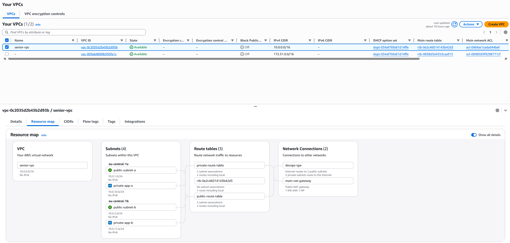

# 🏗️ Secure AWS Network Architecture (Terraform)

Production-style AWS network infrastructure built using Terraform.  
This project demonstrates real-world cloud networking and DevOps practices on AWS.

---

## 📌 Overview

This project implements a secure, scalable, and production-grade AWS network architecture using Terraform.

It focuses on:

- Secure network isolation (public & private subnets)
- Controlled access via Bastion Host
- Scalable traffic routing using Application Load Balancer
- Outbound internet access using NAT Gateway
- Multi-tier architecture design (web + application layer)

---

## 🧠 Architecture Diagram


This diagram represents the full cloud network design, including VPC, public/private subnets, Bastion Host, NAT Gateway, and EC2 instances.

---

## 🏛️ System Architecture Design

### 🌍 Internet Layer
External users access the system through the Application Load Balancer.

---

### ⚖️ Public Subnet Layer
- Application Load Balancer (ALB)
- Bastion Host (secure SSH entry point)
- NAT Gateway (outbound internet access for private instances)

---

### 🔒 Private Subnet Layer
- EC2 Application Server
- No public IP
- Fully isolated from direct internet access

---

## 🔁 Traffic Flow

### 🌐 User Traffic
User → ALB → Private EC2 (Application Server)

### 🔐 Admin Access
Developer → Bastion Host → Private EC2

### 🌍 Outbound Access
Private EC2 → NAT Gateway → Internet Gateway → Internet

---

## 🧱 Infrastructure Components

- Terraform (Infrastructure as Code)
- AWS VPC (network foundation)
- EC2 (compute layer)
- Application Load Balancer
- NAT Gateway
- Security Groups
- Bastion Host

---

## 🧭 AWS Resource Map (Logical Infrastructure View)



This diagram provides a high-level view of how all AWS resources are connected inside the VPC.  
It shows relationships between subnets, routing paths, security layers, and compute resources.

It helps visualize how traffic flows across the infrastructure and how each component interacts within the AWS environment.

---

## 🔐 Security Design

- No direct public access to application servers  
- Bastion host restricted to trusted IPs  
- Private subnet fully isolated  
- ALB is the only public entry point  
- NAT Gateway enables secure outbound traffic  

---

## 📸 Architecture Screenshots

### 🟦 VPC Overview


The VPC isolates all AWS resources within a secure network boundary.

---

### 🔐 Security Groups


Security groups act as virtual firewalls controlling inbound and outbound traffic.

---

### 🚪 NAT Gateway


Enables private EC2 instances to access the internet securely without being publicly exposed.

---

### 🧭 Route Tables


Controls how traffic flows between public and private subnets.

---

### 🖥️ Bastion Host Access


Secure entry point used for SSH access into private instances.

---

### 🧑‍💻 Private EC2 Access


Demonstrates secure access to private EC2 through Bastion Host.

---

### 📦 Terraform Plan


Shows planned infrastructure changes before deployment.

---

### 🚀 Terraform Apply


Confirms successful provisioning of AWS infrastructure using Terraform.

---

## 🚀 Deployment

```bash
terraform init
terraform plan
terraform apply
```

---

## 🧠 Key Learnings

- AWS VPC design and subnet segmentation  
- Secure cloud architecture patterns  
- Bastion host access control  
- Load balancer traffic distribution  
- Infrastructure as Code with Terraform  
- Real-world DevOps networking design  

---

## 🎯 Outcome

This project demonstrates a production-grade AWS network architecture with strong focus on:

✔ Security  
✔ Scalability  
✔ Automation  
✔ Real-world DevOps practices  

---

## 👨‍💻 Author

DevOps Engineer Portfolio Project  
Focused on Cloud Infrastructure, Automation, and Secure Architecture Design