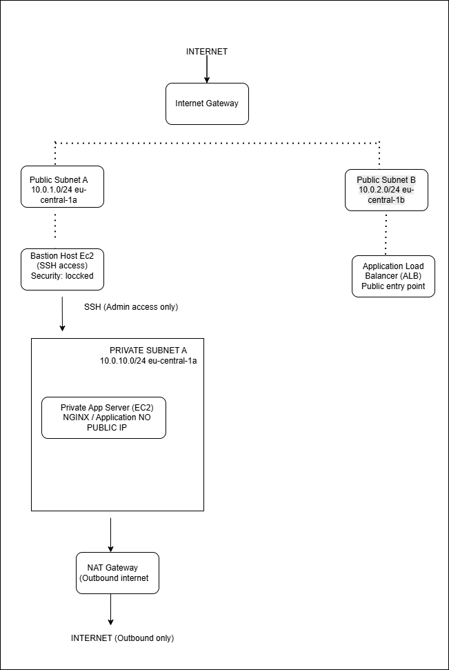
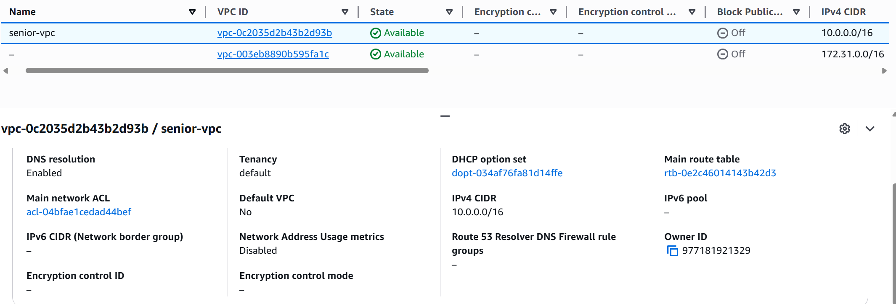
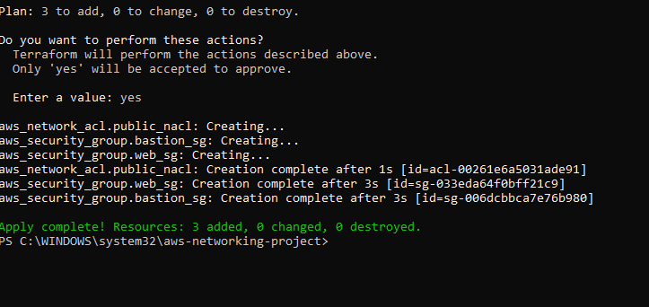
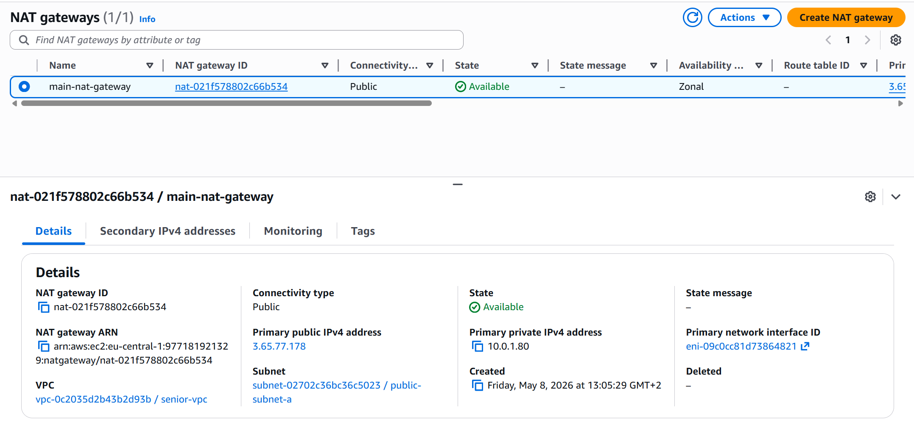
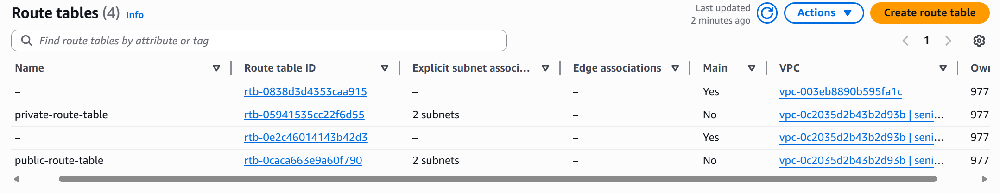
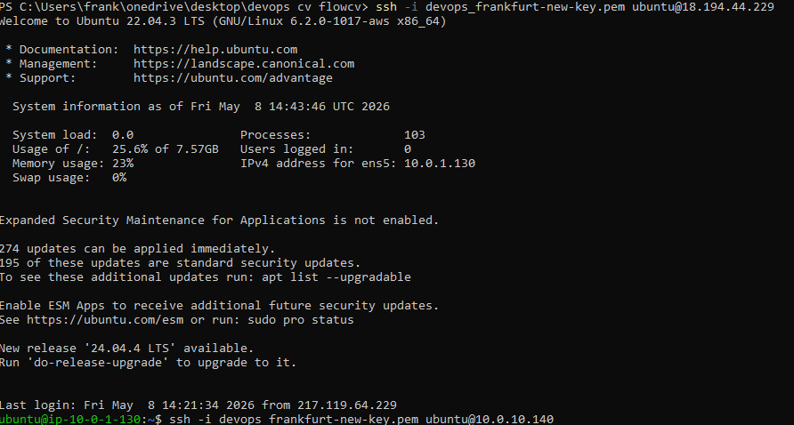
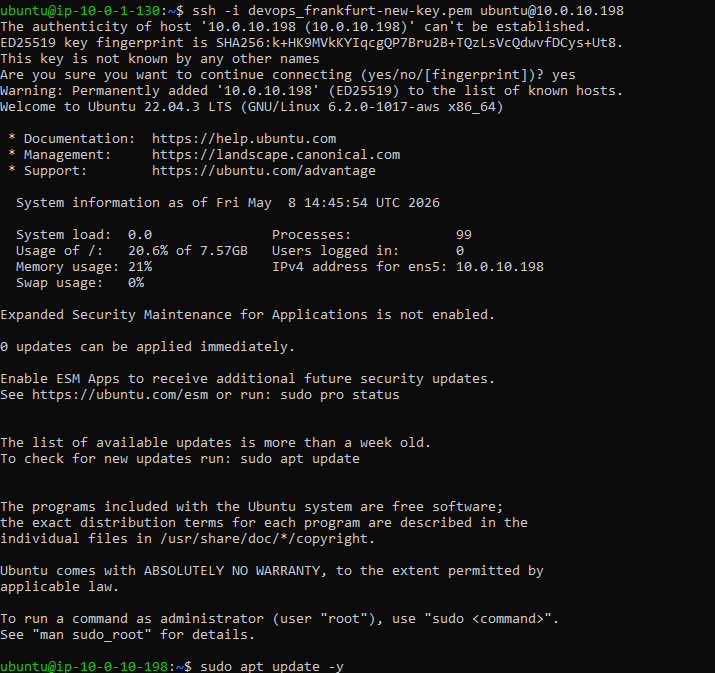
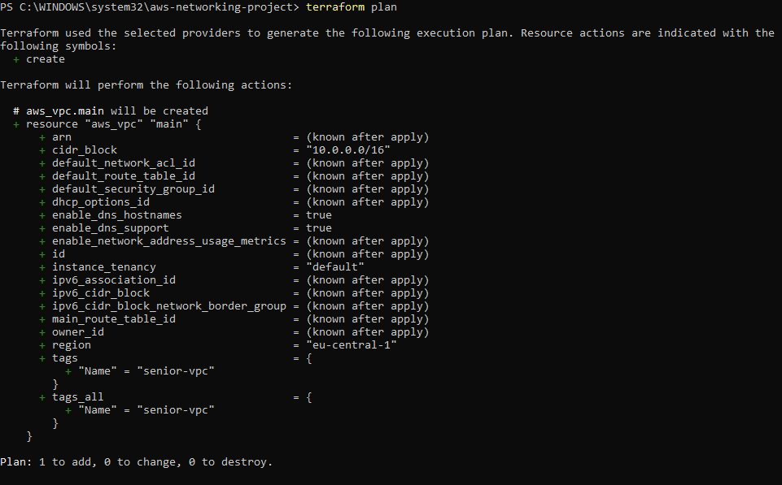
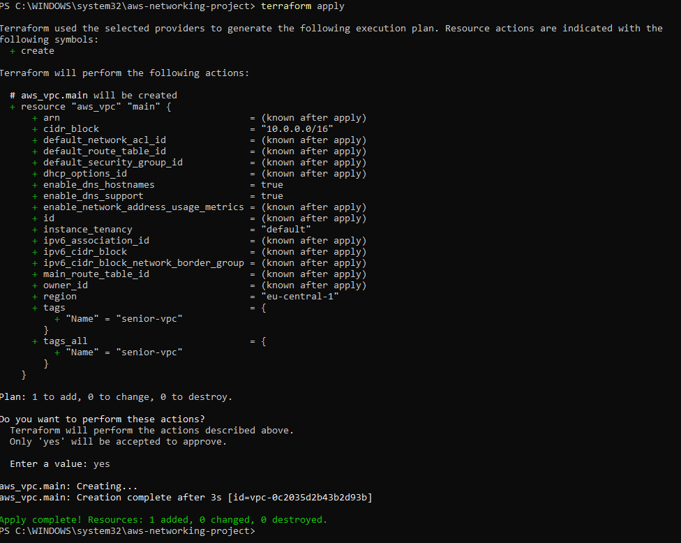

# 🏗️ Secure AWS Network Architecture (Terraform)

Production-style AWS network infrastructure built using Terraform.  
This project demonstrates real-world cloud networking and DevOps practices on AWS.

---

## 📌 Overview

This project implements a secure, scalable, and production-grade AWS network architecture using Terraform.

It focuses on:

- Secure network isolation (public & private subnets)
- Controlled access via Bastion Host
- Scalable traffic routing using Application Load Balancer
- Outbound internet access using NAT Gateway
- Multi-tier architecture design (web + application layer)

---

## 🧠 Architecture Diagram



---

## 🏛️ System Architecture Design

### 🌍 Internet Layer
External users access the system through the Application Load Balancer.

---

### ⚖️ Public Subnet Layer
- Application Load Balancer (ALB)
- Bastion Host (secure SSH entry point)
- NAT Gateway (outbound internet access)

---

### 🔒 Private Subnet Layer
- EC2 Application Server
- No public IP
- Fully isolated from direct internet access

---

## 🔁 Traffic Flow

### 🌐 User Traffic
User → ALB → Private EC2 (Application Server)

### 🔐 Admin Access
Developer → Bastion Host → Private EC2

### 🌍 Outbound Access
Private EC2 → NAT Gateway → Internet Gateway → Internet

---

## 🧱 Infrastructure Components

- Terraform (Infrastructure as Code)
- AWS VPC (network foundation)
- EC2 (compute layer)
- Application Load Balancer
- NAT Gateway
- Security Groups
- Bastion Host

---

## 🔐 Security Design

- No direct public access to application servers
- Bastion host restricted to trusted IPs
- Private subnet fully isolated
- ALB is the only public entry point
- NAT Gateway enables secure outbound traffic

---

## 📸 Architecture Screenshots

### VPC Overview


### Security Groups


### NAT Gateway


### Route Tables


### Bastion Host Access


### Private EC2 Access


### Terraform Plan


### Terraform Apply


---

## 🚀 Deployment

```bash
terraform init
terraform plan
terraform apply
```

---

## 🧠 Key Learnings

- AWS VPC design and subnet segmentation
- Secure cloud architecture patterns
- Bastion host access control
- Load balancer traffic distribution
- Infrastructure as Code with Terraform
- Real-world DevOps networking design

---

## 🎯 Outcome

This project demonstrates a production-grade AWS network architecture with strong focus on:

✔ Security  
✔ Scalability  
✔ Automation  
✔ Real-world DevOps practices  

---

## 👨‍💻 Author

DevOps Engineer Portfolio Project  
Focused on Cloud Infrastructure, Automation, and Secure Architecture Design